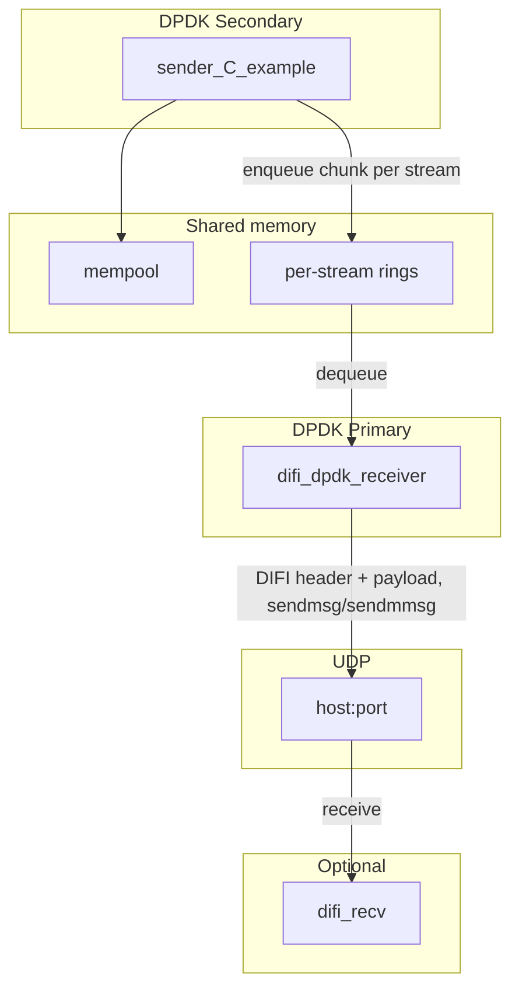
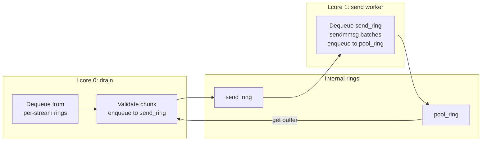

# DIFI API Test: Architecture and How to Run

This document describes the architecture of the DIFI IQ pipeline test and how to build and run it.

---

## 1. Architecture Overview

The test runs a **two-process DPDK pipeline** on one host:

- **Primary process (difi_dpdk_receiver):** Creates a shared **mempool** and one **SPSC ring per stream**. It dequeues IQ chunks from the rings, validates them, wraps them in DIFI headers, and sends UDP packets to a configurable destination. With two or more EAL lcores (e.g. `-l 0,1`), a **dedicated send core** runs a send worker that dequeues from an internal **send_ring**, sends batches via **sendmmsg**, and returns buffers to a **pool_ring**; the main lcore only drains the per-stream rings and enqueues to the send_ring, so the send path is offloaded and the bottleneck is isolated. Optional **`--no-send`** runs drain-only (no UDP send) for testing.
- **Secondary process (sender_C_example):** Attaches to the primary’s mempool and rings, produces deterministic 8-bit IQ chunks, and enqueues them into the per-stream rings.

A separate **DIFI receiver** (e.g. `difi_recv` from DIFI_C_Lib) can run on the same host or a remote host to receive and decode the UDP stream.



**Rings:**

- **Per-stream rings (SPSC):** One producer (sender) per stream, one consumer (receiver). Each element is an mbuf pointer from the shared mempool.
- **Internal rings (when using dedicated send, `-l 0,1`):** The receiver creates a **send_ring** (drain enqueues items to send) and a **pool_ring** (send worker returns buffers). The send worker on the second lcore dequeues from the send_ring, sends in batches with **sendmmsg**, and enqueues buffers back to the pool_ring.

When the receiver uses two lcores (`-l 0,1`), the internal flow is:



**Data path:**

- Sender allocates mbufs from the shared mempool, fills `iq_chunk_hdr` + IQ payload, enqueues mbuf pointer to the stream ring. Receiver dequeues, overwrites the first 32 bytes with the DIFI header (zero-copy payload), sends via UDP.

---

## 2. Components

| Component | Type | Role |
|-----------|------|------|
| **difi_dpdk_receiver** | DPDK primary | Creates mempool/shm and rings; dequeues chunks; validates (magic, version, stream_id, payload_len); sends DIFI over UDP (or drain-only with `--no-send`). With `-l 0,1`, uses a dedicated send core (send_ring/pool_ring, sendmmsg batching). Reports inbound/outbound counts and error % in periodic stats and final summary. |
| **sender_C_example** | DPDK secondary | Produces IQ chunks; enqueues to per-stream rings; optional multi-worker. |
| **run_multi_process.sh** | Script | Starts primary then secondary with setarch and shared EAL/app options. |
| **difi_recv** (DIFI_C_Lib) | Optional | Receives DIFI on UDP, decodes and reports/stores IQ. |

Shared definitions (ring names, chunk header, sample rate, etc.) live in `include/common.h` in both `difi_dpdk_receiver` and `sender_C_example`.

---

## 3. Prerequisites

- **DPDK** with `pkg-config` (e.g. `libdpdk.pc`).
- **Hugepages** configured if using the default mempool path (e.g. `echo 1024 | sudo tee /sys/kernel/mm/hugepages/hugepages-2048kB/nr_hugepages` and mount `/mnt/huge` if required).
- **DIFI_C_Lib** for `difi_recv` (optional); difi_dpdk_receiver builds DIFI_C_Lib as a subdirectory when present.

---

## 4. Build

From the repo root:

```bash
# Receiver (primary)
cd difi_dpdk_receiver && mkdir -p build && cd build && cmake .. && make && cd ../..

# Sender (secondary)
cd sender_C_example && mkdir -p build && cd build && cmake .. && make && cd ../..
```

Binaries:

- `difi_dpdk_receiver/build/difi_dpdk_receiver`
- `sender_C_example/build/sender_C_example`

---

## 5. How to Run

### 5.1. One-command script (recommended)

From the **DIFI_API** directory:

```bash
sudo ./run_multi_process.sh
```

The script:

1. Starts **difi_dpdk_receiver** (primary) with setarch, EAL options, and app options (`--streams 16 --chunk-ms 2 --dest 127.0.0.1:50000`).
2. Waits 3 seconds, then starts **sender_C_example** (secondary) with matching EAL options and app options.
3. Ctrl+C stops the sender first; the script then kills the receiver.

**Environment:**

- `DIFI_DEST=host:port` — override UDP destination (default `127.0.0.1:50000`).
- `DIFI_MAX_RATE=1` — add `--no-rate-limit` to the sender for maximum throughput.

### 5.2. Manual run (two terminals)

**Order:** Start the **primary first**. The secondary blocks in EAL init until it can attach to the primary.

**Recommended: run each process on a separate CPU core** using the EAL option `-l` (lcore list). Use **`-l 0`** for the receiver and **`-l 1`** for the sender. This avoids contention and gives zero dropped packets; **16 streams with 1 worker** run fine with no drops.

**Terminal 1 – primary:** Use **`-l 0`** for a single receiver core, or **`-l 0,1`** to enable a **dedicated send core** (drain on 0, send worker on 1; recommended for high packet rate):

```bash
sudo setarch $(uname -m) -R ./difi_dpdk_receiver/build/difi_dpdk_receiver \
  --proc-type=primary --file-prefix=iqdemo --base-virtaddr=0x2000000000 --legacy-mem -m 512 -l 0,1 -- \
  --streams 16 --chunk-ms 2 --dest 127.0.0.1:50000
```

**Terminal 2 – secondary (after primary is up; pin to core 1):**

```bash
sudo setarch $(uname -m) -R ./sender_C_example/build/sender_C_example \
  --proc-type=secondary --file-prefix=iqdemo --base-virtaddr=0x2000000000 --legacy-mem -m 512 -l 1 -- \
  --streams 16 --chunk-ms 2
```

EAL memory options (before `--`) must match on both processes; the **`-l`** value can and should differ so each process has its own core. The `-R` flag disables ASLR so the secondary can map the primary’s memory; without it the secondary may segfault.

### 5.3. EAL and application options

**EAL (before `--`):**

- `--proc-type=primary` | `--proc-type=secondary` — must match the process role.
- `--file-prefix=iqdemo` — prefix for DPDK multi-process socket and resource names; must be identical on both.
- `--base-virtaddr=0x2000000000` — base VA for DPDK memory; same on both.
- `--legacy-mem -m 512` — hugepage memory; same on both.
- **`-l` (lcore list):** Use **separate cores** for primary and secondary (e.g. **`-l 0`** for receiver, **`-l 1`** for sender) to avoid contention and get zero drops. With this, 16 streams and 1 worker run fine. For a multi-worker sender, give the sender at least N lcores, e.g. `-l 1,2,3,4` for 4 workers (receiver can stay on `-l 0`).

**Application (after `--`):**

| Option | Primary (receiver) | Secondary (sender) | Description |
|--------|--------------------|--------------------|-------------|
| `--streams N` | yes | yes | Number of streams (1–16); must match. |
| `--chunk-ms N` | yes | yes | Chunk duration in ms; must match. |
| `--samples-per-chunk N` | yes | yes | IQ samples per chunk (overrides chunk-ms; must match; use for low latency, e.g. 256). |
| `--file-prefix P` | yes | yes | Match EAL prefix. |
| `--dest host:port` | yes | no | UDP destination for DIFI packets. |
| `--no-send` | yes | no | Receiver drains rings only (no UDP send); for testing. |
| `--no-rate-limit` | no | yes | Sender produces at max rate (receiver must keep up). |
| `--workers W` | no | yes | Sender worker threads (default 1); need W lcores in EAL. With receiver on `-l 0` and sender on `-l 1`, 16 streams and 1 worker run with zero drops. |

### 5.4. Multi-worker sender

To increase sender throughput, run with multiple workers and enough lcores:

```bash
# Example: 4 workers, 4 lcores
sudo setarch $(uname -m) -R ./sender_C_example/build/sender_C_example \
  --proc-type=secondary --file-prefix=iqdemo --base-virtaddr=0x2000000000 --legacy-mem -m 512 -l 0,1,2,3 -- \
  --streams 16 --chunk-ms 2 --workers 4
```

Streams are partitioned across workers; each per-stream ring stays single-producer. With real-time rate limit, N workers can approach ~8000 chunks/s; with `--no-rate-limit`, throughput is limited by the receiver or rings.

### 5.5. Receiver stats and errors

Every second the receiver prints a line such as:

`DIFI RX: inbound X/s, outbound Y/s (dest host:port) time_in_send Z% in_err a.bc% out_err d.ef%`

- **time_in_send:** Fraction of time spent in the send path (TSC-based); with a dedicated send core this reflects the send worker.
- **in_err:** Cumulative **inbound** error rate (chunks dequeued but not sent: bad magic/version/stream_id/payload_len, or in dedicated-send mode when the pool_ring is empty).
- **out_err:** Cumulative **outbound** error rate (send failures, e.g. sendmmsg returned fewer than requested or &lt; 0).

On exit, the final summary shows **Inbound** and **Outbound** sections with chunk/packet counts, bytes, throughput, and **Errors: N (X.XX%)** for each. Counts use atomic reads so they remain correct when the dedicated send worker is updating outbound state.

---

## 6. Cleanup after kill or crash

DPDK leaves runtime files under `/var/run/dpdk/<file-prefix>/`. If the primary was killed without a clean shutdown, remove that directory before starting again:

```bash
sudo rm -rf /var/run/dpdk/iqdemo
```

Then start the **primary** again, then the secondary.

---

## 7. Optional: Verify with difi_recv

To receive and decode the DIFI stream (e.g. on the same host):

1. Start **difi_recv** (from DIFI_C_Lib):  
   `./difi_recv --bind 0.0.0.0:50000`
2. Start **difi_dpdk_receiver** (primary) with `--dest 127.0.0.1:50000`.
3. Start **sender_C_example** (secondary).

Stop order: Ctrl+C on the sender, then the receiver, then difi_recv.

---

## 8. Troubleshooting

| Issue | What to do |
|-------|------------|
| Secondary segfaults | Run the **primary** with `setarch` first; use the **same** EAL options on both. |
| “File exists” / “Cannot reserve memory” | Remove `/var/run/dpdk/iqdemo` (or your file-prefix) and restart primary first. |
| Secondary fails on some platforms | Use the single-process demo: `cd single_process_demo/build && sudo ./single_process_demo -l 0 -- --streams 1 --chunk-ms 2`. |
| `--workers 4` fails | Pass at least 4 lcores to EAL (e.g. `-l 0,1,2,3`). |

---

## 9. More Detail

- **Data formats, rates, and sequence:** [DIFI_IQ_Dataflow.md](DIFI_IQ_Dataflow.md)
- **Receiver options and throughput:** [difi_dpdk_receiver/README.md](../difi_dpdk_receiver/README.md)
- **Sender options and workers:** [sender_C_example/README.md](../sender_C_example/README.md)
- **Third-party integration (sending IQ via DPDK rings):** [Third_Party_Integration_DPDK_Rings.md](Third_Party_Integration_DPDK_Rings.md)
