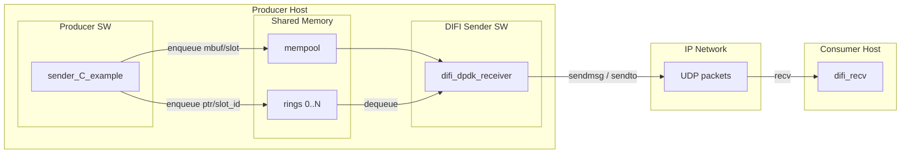
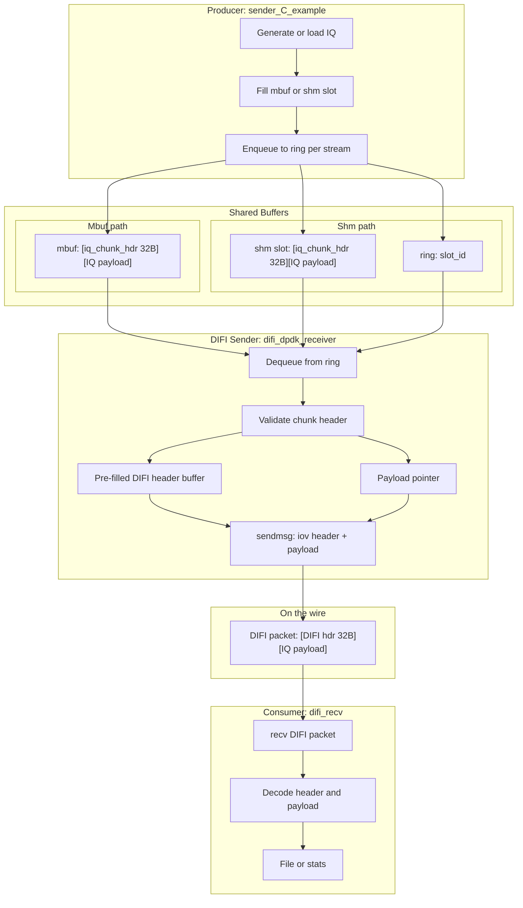

# DIFI IQ Dataflow – End-to-End

This document describes how IQ samples move through the software components and (optionally) hosts from producer to DIFI receiver.

---

## 1. Overview

The pipeline has four main stages:

1. **Producer** – Generates or ingests IQ chunks and enqueues them into per-stream rings.
2. **Shared buffers** – DPDK mempool + rings (or POSIX shm + rings) holding chunk descriptors and optionally payload.
3. **DIFI sender** – Dequeues chunks, adds DIFI headers, and sends UDP packets.
4. **DIFI receiver** – Receives DIFI over UDP and decodes/records IQ.

Components 1–3 typically run on the **same host** (DPDK primary + secondary). The DIFI receiver (4) can run on the same host (e.g. `127.0.0.1`) or on a **remote host** over the network.

---

## 2. High-Level Dataflow (Hosts and Software)



- **Producer host**: runs `sender_C_example` (secondary) and `difi_dpdk_receiver` (primary). They share mempool and rings (or shm + rings).
- **Consumer host**: runs `difi_recv`; can be the same machine (localhost) or another host.

---

## 3. Detailed IQ Dataflow (Buffer and Format)



---

## 4. Data Formats and Rates

| Stage | Format | Size / rate |
|-------|--------|-------------|
| Chunk header (internal) | `iq_chunk_hdr`: magic, version, stream_id, seq, timestamp_ns, payload_len | 32 bytes |
| IQ payload | 8-bit interleaved I/Q (I0,Q0,I1,Q1,...) | 2 bytes per complex sample |
| Sample rate | Fixed | 7.68 Msps |
| Chunk duration | Configurable (e.g. 2 ms) | e.g. 15 360 samples → 30 720 bytes payload |
| Streams | Up to 16 | One ring per stream |
| DIFI header (on wire) | PTYPE 0x1, Class 0x0000, stream_id, seq, timestamp (sec + ps), Class ID | 32 bytes |
| DIFI packet | DIFI header + IQ payload (unchanged) | 32 + payload_bytes |

---

## 5. Component Roles

| Component | Process type | Role |
|-----------|--------------|------|
| **sender_C_example** | DPDK secondary | Allocates mbufs (or shm slots), fills chunk header + deterministic IQ, enqueues to ring per stream. Rate-limited by chunk_ms unless `--no-rate-limit`. |
| **difi_dpdk_receiver** | DPDK primary | Creates mempool and rings (or shm + rings). Sends one standard context packet (PTYPE 0x4) per stream at startup (8-bit IQ) so difi_recv has payload format before first data. Dequeues per stream, validates chunk, uses pre-filled DIFI header + payload pointer, sends one UDP packet per chunk via sendmsg (zero-copy for payload). |
| **difi_recv** | Standard process | Binds to UDP port, receives DIFI packets, decodes context/data, reports stream ID/seq/samples, optionally writes I/Q to file. |

---

## 6. Deployment Variants

**Same host (loopback)**  
- Producer + DIFI sender on one machine.  
- difi_recv on same machine, bind `0.0.0.0:50000`, DIFI dest `127.0.0.1:50000`.

**Two hosts**  
- Producer + DIFI sender on Host A.  
- difi_recv on Host B; DIFI dest = Host B IP (e.g. `192.168.1.2:50000`).  
- Host B runs: `difi_recv --bind 0.0.0.0:50000`.

**Multiple consumers**  
- DIFI is UDP; multiple difi_recv instances can bind to different ports and the DIFI sender can send to multiple `--dest` only if the app is extended to support multiple destinations. Today: one destination per run.

---

## 7. Sequence (Time Order)


---

## 8. File and Component Locations

| Item | Path / binary |
|------|-------------------------------|
| Producer | `sender_C_example/build/sender_C_example` |
| DIFI sender | `difi_dpdk_receiver/build/difi_dpdk_receiver` |
| DIFI receiver | DIFI_C_Lib: `build/difi_recv` |
| Shared definitions | `difi_dpdk_receiver/include/common.h`, `sender_C_example/include/common.h` |
| Run script (primary + sender) | `run_multi_process.sh` (repo root) or `difi_dpdk_receiver/run_difi_receiver.sh` |

### Running manually (two terminals)

The **primary must be running before** the secondary. The secondary blocks in `rte_eal_init()` until it can attach to the primary's shared memory; if you start only the secondary, it will hang after "EAL: Detected shared linkage of DPDK".

**Terminal 1 – start primary first (creates mempool and rings):**

```bash
sudo setarch $(uname -m) -R ./difi_dpdk_receiver/build/difi_dpdk_receiver \
  --proc-type=primary --file-prefix=iqdemo --base-virtaddr=0x2000000000 --legacy-mem -m 512 -- \
  --streams 16 --chunk-ms 2 --use-shm --dest 127.0.0.1:50000
```

**Terminal 2 – after primary is up, start secondary:**

```bash
sudo setarch $(uname -m) -R ./sender_C_example/build/sender_C_example \
  --proc-type=secondary --file-prefix=iqdemo --base-virtaddr=0x2000000000 --legacy-mem -m 512 -- \
  --streams 16 --chunk-ms 2 --use-shm
```

Use the same EAL options (e.g. `-m 512`, `--file-prefix=iqdemo`) on both. The **`-R`** flag (disable ASLR) is required so the secondary can map the primary's memory; without it the secondary may segfault or hang. The `--dest` option is only for the primary (DIFI sender); the sender app does not take `--dest`.

**Important:** **difi_dpdk_receiver** must always be run with `--proc-type=primary`. **sender_C_example** must always be run with `--proc-type=secondary`. If you run the receiver as secondary, you get socket/attach errors and "ring create ... File exists" because the app still tries to create resources.

### After a kill or crash: clean up DPDK state

If you stop the primary with Ctrl+C or kill without a clean shutdown, DPDK leaves socket and runtime files under `/var/run/dpdk/<file-prefix>/`. On the next start the primary then fails with "File exists" or "Cannot reserve memory". Remove that directory before starting again (same prefix as in your `--file-prefix`, default `iqdemo`):

```bash
sudo rm -rf /var/run/dpdk/iqdemo
```

Then start the **primary** (difi_dpdk_receiver) first, then the secondary (sender_C_example). If you use hugepage-backed resources and see persistent issues, you may need to clear hugepages (e.g. `sudo rm -f /dev/hugepages/*` or reboot); for `--use-shm` the socket cleanup is usually enough.

### Throughput (approaching 2 Gbps)

Theoretical payload rate is 7.68 Msps × 2 B × 16 streams ≈ 1966 Mbps. To approach 2 Gbps, run the sender with **`--no-rate-limit`** and ensure the receiver keeps up (e.g. sufficient CPU); both must sustain ~8000 packets/s.

This document focuses on the path used by **difi_dpdk_receiver** and **sender_C_example**; the same ring/mempool layout can be used by **module_b** (validation-only consumer) instead of the DIFI sender.
