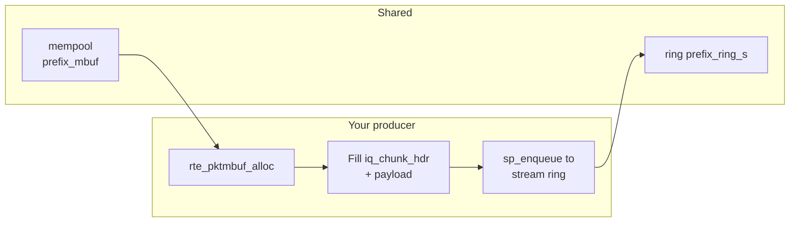
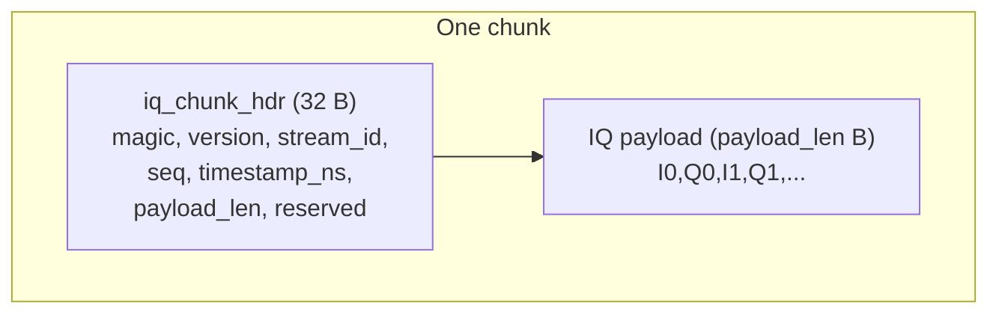
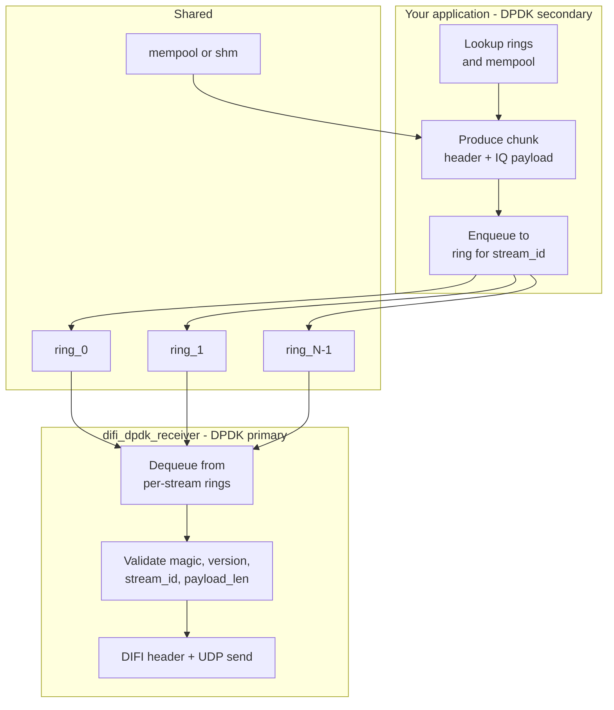

# Third-Party Integration: Sending IQ Samples via DPDK Rings

This document describes how to integrate your software with **difi_dpdk_receiver** so that your application supplies IQ data and the receiver encapsulates it in DIFI packets and sends them over UDP. Your process acts as a **producer**; it attaches to the same DPDK primary process as a **secondary** and enqueues IQ chunks into shared rings that the receiver drains.

---

## 1. Overview

**difi_dpdk_receiver** is the **DPDK primary process**. It creates:

- A **mempool**
- One **SPSC ring per stream** (stream IDs `0` … `N-1`)

Your application runs as a **DPDK secondary process**. It must:

1. Start **after** the primary is running (the primary creates the rings and mempool).
2. Use the **same EAL options** (e.g. `--file-prefix`, `--base-virtaddr`, `-m`) so it can attach to the primary’s resources.
3. **Look up** the mempool and per-stream rings by the agreed names.
4. Produce **IQ chunks** in the format described below and **enqueue** them (as mbuf pointers) to the per-stream ring for the corresponding `stream_id`.

The receiver then dequeues chunks, validates the header, adds a DIFI header, and sends UDP packets to a configurable destination.

```mermaid
flowchart LR
  subgraph your_app [Your application]
    Producer[Your producer]
  end

  subgraph primary [DPDK primary: difi_dpdk_receiver]
    Drain[Drain rings\nValidate + DIFI\nSend UDP]
  end

  subgraph shared [Shared resources]
    StreamRings[per-stream rings\nprefix_ring_0 .. prefix_ring_N-1]
    Mempool[mempool]
  end

  Producer -->|enqueue chunk\n(mbuf ptr)| StreamRings
  Producer --> Mempool
  StreamRings -->|dequeue| Drain
  Drain --> UDP[UDP]
```

---

## 2. Process and EAL Requirements

| Role        | Process                | EAL                      |
|------------|------------------------|---------------------------|
| **Primary**  | difi_dpdk_receiver     | `--proc-type=primary`     |
| **Secondary** | Your application       | `--proc-type=secondary`   |

- The **primary must be started first**. The secondary blocks in `rte_eal_init()` until it can attach.
- **EAL options** (before `--`) must match on both processes: `--file-prefix`, `--base-virtaddr`, `--legacy-mem`, `-m`. Use the same prefix the receiver was started with (e.g. `iqdemo`).
- **Lcores:** Use different lcores for primary and secondary (e.g. primary `-l 0`, your app `-l 1`) to avoid contention.
- On many Linux systems, run the primary with **`setarch $(uname -m) -R`** so the secondary can map shared memory at the same virtual address; otherwise the secondary may segfault.

---

## 3. Data Path (DPDK Mempool)

- The primary creates a **mempool** and **one SPSC ring per stream**.
- Your app **looks up** the mempool and the per-stream rings.
- For each chunk: **allocate an mbuf** from the mempool, fill the first 32 bytes with `struct iq_chunk_hdr`, fill the rest with IQ payload, then **enqueue the mbuf pointer** to the ring for that stream (`rte_ring_sp_enqueue` — single producer).
- The receiver dequeues the mbuf, overwrites the first 32 bytes with the DIFI header (zero-copy payload), sends the packet, and frees the mbuf.



---

## 4. Resource Names

Names depend on the **file prefix** (receiver’s `--file-prefix`, default `iqdemo`). Your app must use the **same** prefix.

| Resource    | Name pattern        | Example (prefix=iqdemo) |
|------------|---------------------|--------------------------|
| Mempool    | `{prefix}_mbuf`     | `iqdemo_mbuf`            |
| Per-stream ring | `{prefix}_ring_{s}` | `iqdemo_ring_0` … `iqdemo_ring_15` |

- **Lookup:** `rte_ring_lookup(name)`, `rte_mempool_lookup(name)`.

---

## 5. Chunk Format

Every chunk has a **32-byte header** (`struct iq_chunk_hdr`) followed by the **IQ payload**. The receiver validates the header; invalid chunks are counted as inbound errors and discarded (mbuf freed).

### 5.1. Header layout (packed, 32 bytes)

| Field         | Type     | Description |
|--------------|----------|-------------|
| `magic`      | uint32_t | Must be `0x48435149` (`IQCH` in LE). |
| `version`    | uint16_t | Must be `1`. |
| `stream_id`  | uint16_t | Stream index, must be `< number_of_streams` (receiver’s `--streams`). |
| `seq`        | uint64_t | Monotonic sequence number for this stream (used for DIFI and diagnostics). |
| `timestamp_ns` | uint64_t | Timestamp in nanoseconds (e.g. TSC-derived or wall clock). |
| `payload_len`| uint32_t | Length of IQ payload in bytes; **must equal** the receiver’s configured payload size. |
| `reserved`   | uint32_t | Set to 0. |

**C struct** (must match the receiver; keep byte layout identical):

```c
#define IQ_CHUNK_MAGIC   0x48435149u   /* "IQCH" LE */
#define IQ_CHUNK_VERSION 1u

struct iq_chunk_hdr {
	uint32_t magic;
	uint16_t version;
	uint16_t stream_id;
	uint64_t seq;
	uint64_t timestamp_ns;
	uint32_t payload_len;
	uint32_t reserved;
} __attribute__((__packed__));
```

### 5.2. Payload

- **IQ payload** immediately follows the header (no gap).
- **Format:** 8-bit interleaved I and Q (I0, Q0, I1, Q1, …). So payload size = 2 × number of samples.
- **Size:** `payload_len` must equal the receiver’s value. The receiver is started with `--chunk-ms N` and/or `--samples-per-chunk N`; it computes `samples_per_chunk` and `payload_bytes = samples_per_chunk * 2`. Your app must use the **same** chunk size (same `--streams`, `--chunk-ms`, `--samples-per-chunk` as the primary).

### 5.3. Chunk size limits

- Total chunk size = 32 + `payload_len`; must fit in the mempool mbuf data room (e.g. 64 KB).



---

## 6. Per-Stream Rings (SPSC)

- There is **one ring per stream**: stream ID `s` uses ring `{prefix}_ring_{s}`.
- Each per-stream ring is **SPSC** (single producer, single consumer). Your process (or one designated lcore/thread) must be the **only** producer for that ring; the receiver is the only consumer.
- If you use multiple threads, assign **each stream to a single producer** (e.g. one thread per stream, or partition streams across threads) so each ring has one producer.
- Ring capacity is 511 (one less than the created size 512); if the ring is full, enqueue fails — back off or drop and count.

---

## 7. Integration Steps (Checklist)

1. **Start difi_dpdk_receiver (primary)** with the desired `--file-prefix`, `--streams`, `--chunk-ms` and/or `--samples-per-chunk`. Example:
   ```bash
   ./difi_dpdk_receiver --proc-type=primary --file-prefix=iqdemo -m 512 -l 0 -- \
     --streams 8 --chunk-ms 2 --dest 192.168.1.10:50000
   ```
2. **Start your process as secondary** with the **same** EAL prefix and memory options, and the **same** app parameters for streams and chunk size:
   ```bash
   ./your_app --proc-type=secondary --file-prefix=iqdemo -m 512 -l 1 -- \
     --streams 8 --chunk-ms 2
   ```
3. In your app after `rte_eal_init()`: look up mempool `{prefix}_mbuf` and rings `{prefix}_ring_0` … `{prefix}_ring_(N-1)`.
4. For each chunk:
   - Set `magic = IQ_CHUNK_MAGIC`, `version = IQ_CHUNK_VERSION`, `stream_id = s`, `seq`, `timestamp_ns`, `payload_len = <agreed payload bytes>`, `reserved = 0`.
   - Fill the IQ payload after the header.
   - Allocate mbuf from the mempool, write header+payload into mbuf data, then `rte_ring_sp_enqueue(g_rings[s], mbuf)`.
5. If enqueue to the stream ring fails, free the mbuf (`rte_pktmbuf_free`) so the mempool can reuse it.

---

## 8. Reference: Constants and Helpers

You can copy the following from the receiver/sender codebase (e.g. `difi_dpdk_receiver/include/common.h`) so your app uses the same layout and names:

- `IQ_CHUNK_MAGIC`, `IQ_CHUNK_VERSION`
- `struct iq_chunk_hdr`
- Ring/mempool name helpers: `iq_ring_name(prefix, stream_id, out, out_len)`, `iq_mempool_name(prefix, out, out_len)`
- Chunk size helpers: `iq_samples_per_chunk(sample_rate_hz, chunk_ms)`, `iq_payload_bytes(samples_per_chunk)`, `iq_total_chunk_bytes(payload_bytes)`

Sample rate is fixed at **7.68 Msps** in the current receiver; chunk duration is determined by `--chunk-ms` or `--samples-per-chunk`.

---

## 9. Example Reference

The **sender_C_example** project in this repository is a working secondary that produces IQ chunks and enqueues to the same rings. You can use it as a reference for:

- EAL and app option parsing
- Mempool vs shm lookup and mmap
- Filling `struct iq_chunk_hdr` and payload
- SPSC enqueue to per-stream rings and (for shm) dequeue/enqueue of the free ring

See `sender_C_example/src/sender_C_example.c` and `sender_C_example/include/common.h` (or `difi_dpdk_receiver/include/common.h`).

---

## 10. Summary Diagram



Your process and difi_dpdk_receiver must agree on **file prefix**, **number of streams**, and **chunk size** (via `--chunk-ms` / `--samples-per-chunk`). With that, you only need to produce valid chunks and enqueue them (as mbuf pointers) to the correct per-stream ring.
